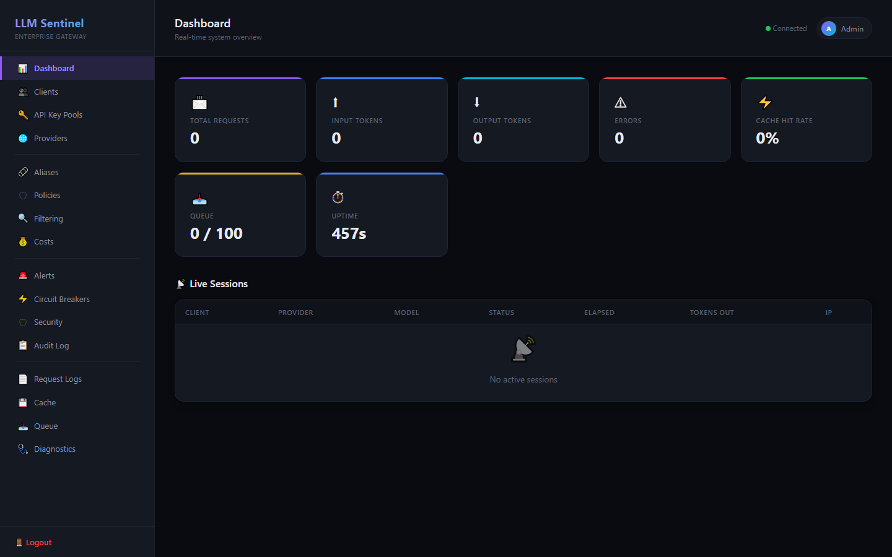
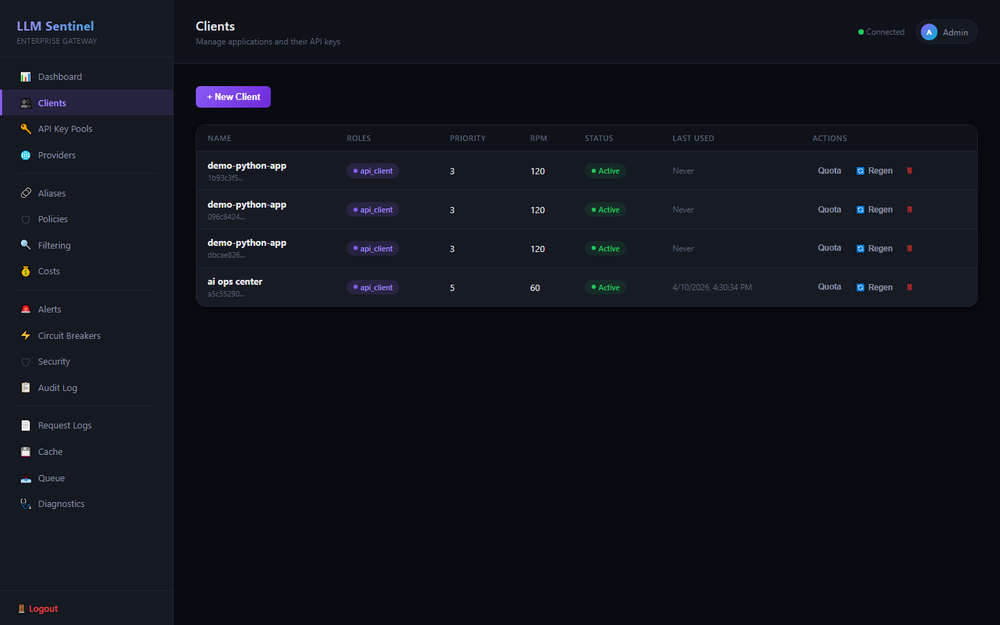
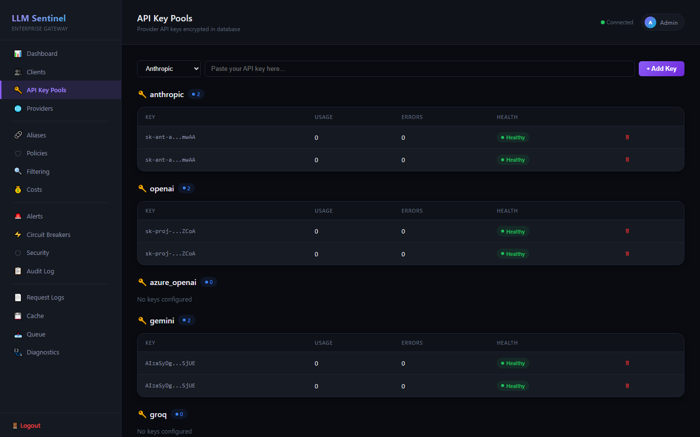
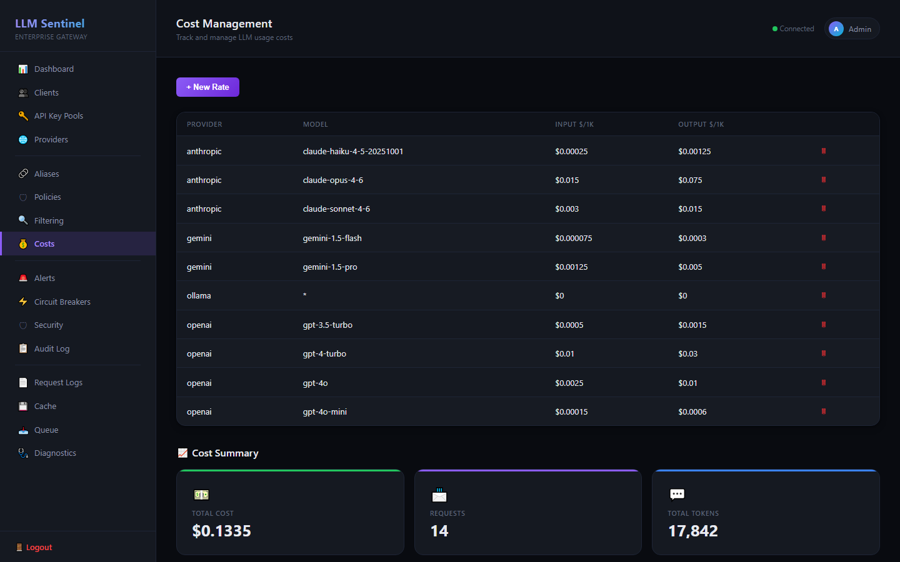
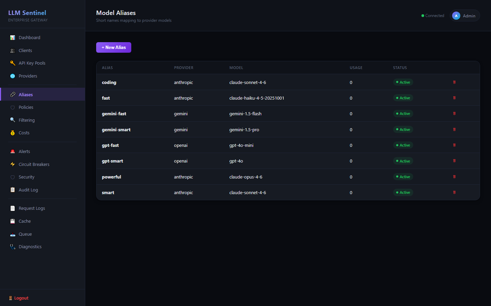
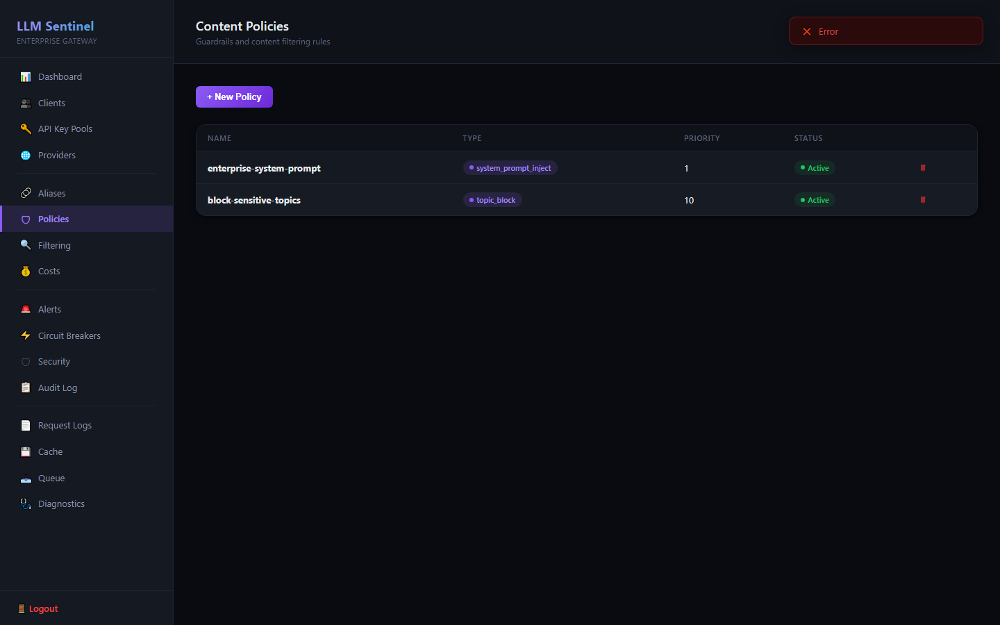
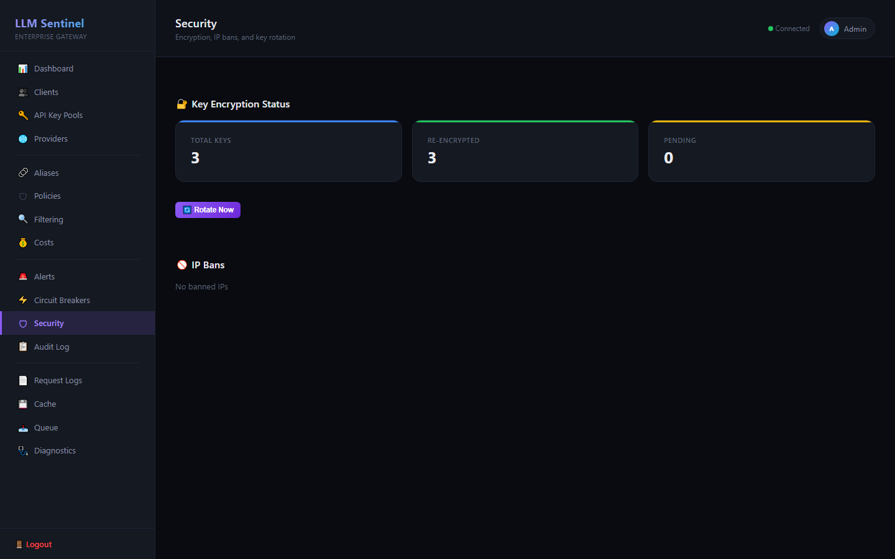
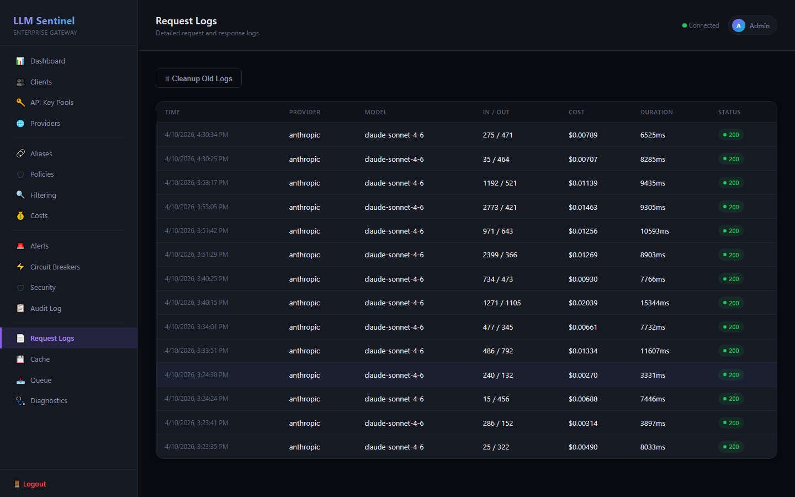
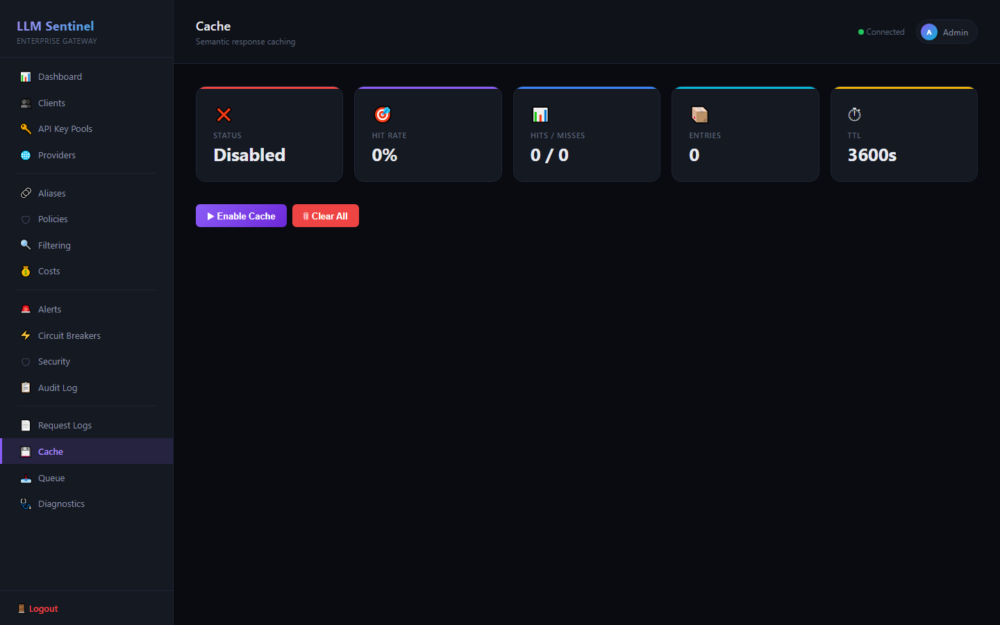

# LLM Sentinel

[](https://opensource.org/licenses/MIT)
[](https://www.python.org/downloads/)
[](#running-tests)
[](#usage)

**Enterprise LLM Gateway & Policy Engine — unified API, intelligent routing, full governance.**

LLM Sentinel is a high-performance gateway that unifies access to all major LLM providers through a single OpenAI-compatible API. It gives engineering and platform teams centralized control over AI usage — routing, cost management, access policies, and real-time observability — without changing a single line of application code.

Connect **Anthropic, OpenAI, Azure OpenAI, Gemini, AWS Bedrock, Groq, Mistral, Ollama**, or any OpenAI-compatible endpoint. Any tool that speaks the OpenAI protocol (Cursor, Continue, Cline, LangChain, LlamaIndex, custom apps) works instantly — just change `base_url` and `api_key`.

> **If you find this project useful, please consider giving it a star!** It helps others discover the project.

## Screenshots

| Dashboard | Clients | API Key Pools |
|:---------:|:-------:|:------------:|
|  |  |  |

| Cost Tracking | Aliases | Content Policies |
|:------------:|:-------:|:----------------:|
|  |  |  |

| Security | Request Logs | Cache |
|:--------:|:------------:|:-----:|
|  |  |  |

<details>
<summary><strong>View all 34 screenshots</strong></summary>

See the full collection: [docs/screenshots/](docs/screenshots/)

</details>

---

## Key Capabilities

### Unified Gateway
- **9 built-in providers** + unlimited custom OpenAI-compatible endpoints
- **OpenAI-compatible API** — drop-in replacement, zero code changes
- **Model aliasing** — `"model": "fast"` routes to the best model for the job
- **Intelligent routing** — auto-detect provider from model name, fallback chains

### Policy Engine & Governance
- **Content policies** — 6 policy types: system prompt injection, topic blocking, model restriction, output filtering, max tokens, PII redaction
- **Data masking** — 20 built-in regex patterns auto-redact passwords, API keys, credit cards, SSNs before they reach the LLM
- **Per-client permissions** — fine-grained access control (chat, embeddings, models:list, etc.)
- **Audit trail** — every auth event, config change, and policy action is logged

### Performance & Reliability
- **Async architecture** — FastAPI + uvicorn, handles hundreds of concurrent requests per worker
- **Multi-worker scaling** — `PROXY_WORKERS=N` for horizontal scaling across CPU cores
- **Semantic caching** — identical requests return cached responses instantly, reducing cost and latency
- **Circuit breaker** — automatic failover with configurable thresholds and recovery timeouts
- **Priority queuing** — high-priority clients are served first under load (priority 1-10)
- **Key rotation** — round-robin, random, or least-used API key selection with automatic health tracking

### Cost Management
- **Real-time cost tracking** — per-request, per-client, per-model cost calculation
- **Built-in pricing** — 10 pre-loaded rates for Anthropic, OpenAI, Gemini, Ollama
- **Daily quotas** — per-client token limits with automatic enforcement
- **RPM + TPM rate limiting** — requests/minute and tokens/minute at client, IP, and global levels

### Observability & Operations
- **Admin dashboard** — 18-tab dark-theme UI with WebSocket live session monitoring
- **Prometheus metrics** — requests, tokens, costs, cache hits, queue depth, circuit breaker states
- **Structured JSON logging** — production-ready log format with request correlation IDs
- **Webhook alerts** — Slack, Teams, or any HTTP endpoint for circuit breaks, quota breaches, key failures

### Enterprise Security
- **AES-256-GCM encryption** — API keys and sensitive data encrypted at rest
- **JWT + API key auth** — dual authentication with IP binding and session limits
- **LDAP/AD integration** — enterprise SSO with group-based role mapping
- **Request signing** — HMAC-SHA256 replay protection for critical clients
- **Password policies** — minimum complexity, common password check, history enforcement

---

## Architecture

```
  Applications                 LLM Sentinel Gateway              LLM Providers
                          ┌───────────────────────────┐
                          │                           │
  Cursor IDE ─────┐       │   ┌─ Auth & Permissions   │       ┌── Anthropic
  Continue   ─────┤       │   ├─ Policy Engine        │       ├── OpenAI
  Python App ─────┤──────>│   ├─ Rate Limiter (RPM)   │──────>├── Azure OpenAI
  LangChain  ─────┤       │   ├─ Token Limiter (TPM)  │       ├── Google Gemini
  curl / API ─────┘       │   ├─ Cost Calculator      │       ├── AWS Bedrock
                          │   ├─ Data Masking          │       ├── Groq
  OpenAI-compatible       │   ├─ Semantic Cache        │       ├── Mistral
  base_url + api_key      │   ├─ Circuit Breaker       │       ├── Ollama
                          │   ├─ Priority Queue        │       └── Custom endpoints
                          │   └─ Live Monitoring       │
                          │                           │
                          └───────────────────────────┘
                             Admin Dashboard (18 tabs)
                             Prometheus Metrics
                             Webhook Alerts
```

**Without Sentinel:** Each app holds its own API keys, costs are invisible, no usage policies, no audit trail.

**With Sentinel:** One gateway, centralized key management, per-client governance, real-time visibility, automatic failover.

---

## Requirements

| Requirement | Version | Note |
|------------|---------|------|
| Python | 3.12 or higher | 3.14 supported |
| pip | latest | `python -m pip install --upgrade pip` |
| Git | 2.40+ | Optional (only for cloning) |
| Redis | 7+ | **Optional** — in-memory fallback used if not available |
| PostgreSQL | 16+ | **Optional** — SQLite (default) used if not available |

---

## First-Time Setup (Step by Step)

### 1. Clone the Repository

```bash
git clone https://github.com/ozdemirumit/LLM-Sentinel.git
cd LLM-Sentinel
```

### 2. Create a Virtual Environment

**Windows (cmd):**
```bash
python -m venv .venv
.venv\Scripts\activate.bat
```

**Windows (PowerShell):**
```powershell
python -m venv .venv
.venv\Scripts\Activate.ps1
```

**Linux / macOS:**
```bash
python3 -m venv .venv
source .venv/bin/activate
```

### 3. Install Dependencies

```bash
pip install -r requirements.txt
```

> **Note:** `tiktoken` requires a Rust compiler. If not available, the proxy automatically falls back to a character/4 estimation. If Rust is installed: `pip install tiktoken`

### 4. Create the Environment File

```bash
cp .env.example .env
```

Now open `.env` in a text editor and fill in the **two required variables**:

#### JWT_SECRET (REQUIRED)

Used to sign JWT tokens. Must be at least 32 characters:

```bash
python -c "import secrets; print(secrets.token_hex(32))"
```

Paste the generated value into the `JWT_SECRET=` line in `.env`:
```
JWT_SECRET=paste_the_generated_64_char_hex_value_here
```

#### KEY_ENCRYPTION_SECRET (RECOMMENDED)

Used to encrypt API keys in the database:

```bash
python -c "import secrets; print(secrets.token_hex(32))"
```

```
KEY_ENCRYPTION_SECRET=paste_the_generated_64_char_hex_value_here
```

> **Important:** Back up these two secrets in a safe place. If you lose them, existing JWT tokens and encrypted API keys will become unusable.

### 5. Start the Server

**Windows:**
```bash
run.bat
```

**Or directly:**
```bash
python main.py
```

Successful output looks like:
```
INFO  db: Database tables initialized
INFO  filter_db: Seeded built-in filter patterns | {"count": 20}
INFO  model_alias: Seeded built-in model aliases | {"count": 7}
INFO  cost_tracker: Seeded built-in cost rates | {"count": 10}
INFO  main: LLM Sentinel started | {"host": "0.0.0.0", "port": 8765, ...}
INFO  Uvicorn running on http://0.0.0.0:8765
```

On first run, the following are automatically created:
- `data/proxy.db` SQLite database with 15 tables
- 20 built-in filter patterns (passwords, API keys, credit cards, SSNs, etc.)
- 7 model aliases (fast, smart, powerful, etc.)
- 10 cost rates (Anthropic, OpenAI, Gemini, Ollama)

### 6. Create an Admin User

**Open a separate terminal** (while the server is running):

```bash
cd LLM-Sentinel
.venv\Scripts\activate.bat        # Windows
# or: source .venv/bin/activate    # Linux/Mac

python main.py --create-admin
```

It will interactively ask:
```
=== LLM Sentinel — Admin User Setup ===

Admin username: admin
Admin password: ********
Confirm password: ********

Admin user 'admin' created successfully.
```

> **Password requirements:** At least 12 characters (8 in test mode), 1 uppercase, 1 lowercase, 1 digit, 1 special character. Example: `MyStr0ng!Pass`

### 7. Log In to the Admin Panel

Open in browser: **http://localhost:8765/admin/login**

Sign in with the admin username and password you just created.

### 8. Add API Keys

In the admin panel:
1. Go to the **API Key Pools** tab
2. Select a provider from the dropdown (e.g. `anthropic`)
3. Paste your API key into the input field (e.g. `sk-ant-...`)
4. Click **Add Key**

> API keys are **never** stored in `.env`. They are always added via the Admin UI and encrypted in the database.

### 9. Create a Client (Application)

In the admin panel:
1. Go to the **Clients** tab
2. Click **+ New Client**
3. Fill in the form: name, permissions, rate limit, priority
4. Click **Create**
5. **Copy the displayed API key immediately** — it won't be shown again

If you lose the key, click **Regen Key** on the client row to generate a new one.

---

## Usage

Connect any OpenAI-compatible client to LLM Sentinel — just change two lines:

### With OpenAI SDK (Python)

```python
from openai import OpenAI

# Just change base_url and api_key — everything else stays the same
client = OpenAI(
    base_url="http://localhost:8765/v1",   # LLM Sentinel endpoint
    api_key="sk-proxy-xxx",                # Client key from Admin UI
)

# Use aliases: "fast" = Claude Haiku, "smart" = Claude Sonnet, "gpt-smart" = GPT-4o
response = client.chat.completions.create(
    model="fast",
    messages=[{"role": "user", "content": "Hello!"}],
)
print(response.choices[0].message.content)
```

### With curl

```bash
curl -X POST http://localhost:8765/v1/chat/completions \
  -H "Authorization: Bearer sk-proxy-xxx" \
  -H "Content-Type: application/json" \
  -d '{
    "model": "smart",
    "messages": [{"role": "user", "content": "Hello!"}]
  }'
```

### With JavaScript / Node.js

```javascript
import OpenAI from "openai";

const client = new OpenAI({
  baseURL: "http://localhost:8765/v1",
  apiKey: "sk-proxy-xxx",
});

const response = await client.chat.completions.create({
  model: "gpt-smart",
  messages: [{ role: "user", content: "Hello!" }],
});
```

### With LangChain

```python
from langchain_openai import ChatOpenAI

llm = ChatOpenAI(
    base_url="http://localhost:8765/v1",
    api_key="sk-proxy-xxx",
    model="smart",
)

response = llm.invoke("Explain machine learning in one paragraph.")
print(response.content)
```

### With LlamaIndex

```python
from llama_index.llms.openai import OpenAI

llm = OpenAI(
    api_base="http://localhost:8765/v1",
    api_key="sk-proxy-xxx",
    model="smart",
)

response = llm.complete("What is retrieval augmented generation?")
print(response.text)
```

---

## Client Configuration Guide

Any application that supports custom OpenAI endpoints works with LLM Sentinel. Here are step-by-step instructions for popular tools.

### Cursor IDE

1. Open **Settings** (Ctrl+Comma or Cmd+Comma)
2. Go to **Models** section
3. Configure:
   - **OpenAI API Base:** `http://localhost:8765/v1`
   - **API Key:** `sk-proxy-xxx` (your client key from Admin UI)
   - **Model:** `smart` or `fast` or any model name
4. All AI features (Tab completion, Chat, Composer) now route through LLM Sentinel

> **Tip:** Use the `fast` alias for Tab completions (speed matters) and `smart` for Chat/Composer (quality matters).

### Continue (VS Code / JetBrains)

Edit the Continue config file:
- **VS Code:** `~/.continue/config.json`
- **JetBrains:** `~/.continue/config.json`

```json
{
  "models": [
    {
      "title": "LLM Sentinel - Smart",
      "provider": "openai",
      "model": "smart",
      "apiBase": "http://localhost:8765/v1",
      "apiKey": "sk-proxy-xxx"
    },
    {
      "title": "LLM Sentinel - Fast",
      "provider": "openai",
      "model": "fast",
      "apiBase": "http://localhost:8765/v1",
      "apiKey": "sk-proxy-xxx"
    }
  ],
  "tabAutocompleteModel": {
    "title": "LLM Sentinel - Autocomplete",
    "provider": "openai",
    "model": "fast",
    "apiBase": "http://localhost:8765/v1",
    "apiKey": "sk-proxy-xxx"
  }
}
```

### Cline (VS Code Extension)

1. Open Cline settings (click the gear icon in the Cline panel)
2. Configure:
   - **API Provider:** `OpenAI Compatible`
   - **Base URL:** `http://localhost:8765/v1`
   - **API Key:** `sk-proxy-xxx`
   - **Model:** `smart`

### Aider

```bash
# Set environment variables
export OPENAI_API_BASE=http://localhost:8765/v1
export OPENAI_API_KEY=sk-proxy-xxx

# Run aider with any alias
aider --model openai/smart
```

Or in `~/.aider.conf.yml`:
```yaml
openai-api-base: http://localhost:8765/v1
openai-api-key: sk-proxy-xxx
model: openai/smart
```

### Open WebUI

1. Go to **Admin Panel** > **Settings** > **Connections**
2. Add a new OpenAI connection:
   - **URL:** `http://localhost:8765/v1`
   - **API Key:** `sk-proxy-xxx`
3. Save and select models from the model dropdown

### TypingMind

1. Go to **Settings** > **Custom Endpoint**
2. Configure:
   - **Endpoint:** `http://localhost:8765/v1/chat/completions`
   - **API Key:** `sk-proxy-xxx`
   - **Model:** `smart`

### AutoGen / CrewAI

```python
import autogen

config_list = [
    {
        "model": "smart",
        "base_url": "http://localhost:8765/v1",
        "api_key": "sk-proxy-xxx",
    }
]

assistant = autogen.AssistantAgent(
    name="assistant",
    llm_config={"config_list": config_list},
)
```

### Generic Configuration (Any OpenAI-Compatible Client)

For any tool or library that supports custom OpenAI endpoints:

| Setting | Value |
|---------|-------|
| **Base URL / API Base** | `http://localhost:8765/v1` |
| **API Key** | `sk-proxy-xxx` (from Admin UI > Clients) |
| **Model** | Any alias (`fast`, `smart`, `powerful`) or real model name (`claude-sonnet-4-6`, `gpt-4o`) |
| **API Type** | `openai` or `openai-compatible` |

**The key insight:** LLM Sentinel speaks the OpenAI API protocol. Any client that can talk to OpenAI can talk to Sentinel — just change the URL and key.

---

## Model Aliases

Use short names to select provider/model combinations:

| Alias | Provider | Actual Model |
|-------|----------|-------------|
| `fast` | Anthropic | claude-haiku-4-5-20251001 |
| `smart` | Anthropic | claude-sonnet-4-6 |
| `powerful` | Anthropic | claude-opus-4-6 |
| `gpt-fast` | OpenAI | gpt-4o-mini |
| `gpt-smart` | OpenAI | gpt-4o |
| `gemini-fast` | Gemini | gemini-1.5-flash |
| `gemini-smart` | Gemini | gemini-1.5-pro |

You can add custom aliases from Admin UI > **Aliases** tab > **+ New Alias**.

---

## Admin Panel Guide (All Tabs)

After logging in at `http://localhost:8765/admin/login`, you will see a sidebar with 17 menu items. Here is what each tab does and how to use it.

### Dashboard

The main overview page. Shows real-time statistics at a glance.

- **Stat cards:** Total Requests, Input Tokens, Output Tokens, Errors, Cache Hit Rate, Queue usage, Uptime
- **Live Sessions:** A WebSocket-powered table that shows all in-flight chat requests in real time. Each row displays the client name, provider, model, status (queued/running/streaming/done/error), elapsed time, output tokens so far, and client IP. The green dot indicator shows whether the WebSocket connection is active.

No action buttons on this tab — it is purely for monitoring.

### Clients

Manage the applications that connect to the proxy. Each client gets a unique `sk-proxy-xxx` API key.

- **+ New Client:** Opens a form to create a client. Fields:
  - **Name:** A descriptive name (e.g. `cursor-ide`, `my-python-app`)
  - **Permissions:** Comma-separated list of allowed actions. Use `*` for full access, or specific values like `chat`, `chat:stream`, `models:list`, `embeddings`, `health`, `stats`, `filter`, `config:read`
  - **Rate Limit (RPM):** Maximum requests per minute for this client
  - **Daily Token Quota:** Maximum tokens per day (0 = unlimited)
  - **Priority:** 1 (highest) to 10 (lowest) — used for queue ordering when the system is under load
  - **Description:** Optional note
- **Quota:** View the client's current daily token usage
- **Regen Key:** Generate a new API key (the old one stops working immediately)
- **Delete:** Permanently remove the client and all its usage data

### API Key Pools

Manage the actual LLM provider API keys (e.g. your Anthropic, OpenAI keys).

- **Provider dropdown:** Select which provider to add a key for (anthropic, openai, azure_openai, gemini, groq, mistral, ollama)
- **Key input field:** Paste your provider API key here
- **Add Key:** Saves the key (encrypted with AES-256-GCM in the database)
- **Per-key table:** Shows each key's masked value, usage count, error count, and health status
- **Remove:** Delete a key from the pool

The proxy rotates through healthy keys using the configured strategy (round-robin, random, or least-used). If a key gets too many errors, it is automatically marked unhealthy and skipped.

### Providers

Configure custom LLM endpoints beyond the 9 built-in providers.

- **+ Add Provider:** Opens a form with:
  - **Name:** Unique identifier (e.g. `my-vllm-server`)
  - **Type:** `openai_compatible` (for vLLM, LiteLLM, LocalAI, text-generation-webui), `ollama`, or any built-in type
  - **Base URL:** The endpoint URL (e.g. `http://gpu-server:8000/v1`)
  - **Default Model:** The model name to use if none is specified
- **Test:** Sends a connection test to the provider and shows available models
- **Delete:** Deactivates the provider (soft delete)

### Aliases

Create short, memorable names that map to specific provider + model combinations.

- **+ New Alias:** Create a mapping, e.g. alias `coding` → provider `anthropic` + model `claude-sonnet-4-6`
  - **Alias:** Must be a lowercase slug (letters, numbers, hyphens only)
  - **Provider:** The target provider name
  - **Model:** The target model name
- **Usage count:** Shows how many times each alias has been used
- **Delete:** Remove the alias

7 built-in aliases are pre-loaded (fast, smart, powerful, gpt-fast, gpt-smart, gemini-fast, gemini-smart). Clients can use `"model": "fast"` in their requests and the proxy resolves it automatically.

### Policies

Define content policies (guardrails) that control what goes in and out of the LLM.

- **+ New Policy:** Create a policy with:
  - **Name:** Descriptive name
  - **Type:** One of:
    - `system_prompt_inject` — Prepend a system message to every request (e.g. "You are a helpful enterprise assistant")
    - `system_prompt_enforce` — Replace any client-provided system prompt with your own
    - `topic_block` — Block or redact messages containing specific keywords or regex patterns
    - `output_filter` — Scan LLM responses for PII (emails, SSNs, credit cards) and redact them
    - `max_output_tokens` — Enforce a maximum response length
    - `model_restrict` — Only allow specific models (supports glob patterns like `gpt-4*`)
  - **Config (JSON):** Policy-specific configuration. Examples:
    - Topic block: `{"blocked_keywords": ["hack", "exploit"], "action": "reject", "message": "Blocked by policy."}`
    - System inject: `{"prompt": "Always respond in English."}`
    - Model restrict: `{"allowed_models": ["gpt-4o-mini", "claude-haiku-*"], "deny_message": "Model not allowed."}`
  - **Priority:** Lower number runs first. If a policy rejects the request, later policies are skipped.
- **Delete:** Remove the policy

### Filtering

Manage regex patterns used to automatically mask sensitive data in chat messages before they reach the LLM.

- **+ New Pattern:** Create a custom pattern with:
  - **Name:** Descriptive name
  - **Regex Pattern:** The regular expression to match (e.g. `(?i)password\s*[:=]\s*\S+`)
  - **Replacement:** What to replace matches with (e.g. `[PASSWORD]`)
- **Delete:** Remove custom patterns. Built-in patterns (marked with a blue "Built-in" badge) cannot be deleted but can be toggled off.

20 built-in patterns are pre-loaded covering passwords, API keys (OpenAI, Anthropic, AWS, GitHub, Slack, Google), JWT tokens, credit cards, SSNs, private keys, connection strings, and email addresses.

### Costs

Track and manage the cost of LLM usage.

- **Cost Rates table:** Shows per-model pricing (input and output cost per 1K tokens). 10 built-in rates are pre-loaded for popular models.
- **+ New Rate:** Add pricing for a new model
- **Remove:** Deactivate a cost rate
- **Cost Summary cards:** Total cost (USD), total requests, and total tokens across all clients

Every chat request automatically calculates cost based on the matching rate and records it in the database.

### Alerts

Configure webhook notifications for important system events.

- **+ New Alert:** Create a webhook endpoint that gets called when events occur:
  - **Event Type:** `*` (all events), `circuit_open`, `no_healthy_keys`, `quota_breach`, `system_error`, `ip_ban`
  - **Webhook URL:** The URL to POST to (e.g. a Slack incoming webhook)
  - **Min Severity:** Only fire for events at this severity or higher (`info`, `warning`, `critical`)
- **Test:** Send a test ping to verify the webhook works
- **Delete:** Remove the alert configuration
- **Alert History table:** Shows all sent alerts with timestamp, event, severity, message, and success/failure status

Webhook payloads are signed with HMAC-SHA256 if `WEBHOOK_SECRET` is configured.

### Circuit Breakers

View and manage circuit breaker states for provider API keys.

- Each row shows a `provider:key_index` pair and its current state:
  - **CLOSED** (green): Normal operation, requests flow through
  - **HALF_OPEN** (yellow): Testing if the provider has recovered
  - **OPEN** (red): Provider is failing, requests are blocked and routed to fallback
- **Reset:** Manually reset a circuit breaker back to CLOSED state

Circuit breakers automatically open after repeated failures (configurable via `CB_FAILURE_THRESHOLD` in `.env`) and attempt recovery after `CB_RECOVERY_TIMEOUT_SECONDS`.

### Security

Security overview and management tools.

- **Key Rotation Status:** Shows how many API keys are encrypted with the current key vs. the previous key
  - **Rotate Now:** Re-encrypts any keys still using the old encryption key (used after rotating `KEY_ENCRYPTION_SECRET`)
- **IP Bans:** Lists IPs that have been temporarily banned due to too many failed authentication attempts
  - **Unban:** Manually remove an IP from the ban list

### Audit Log

A read-only log of all security-relevant events in the system.

- Each entry shows: timestamp, event type (AUTH_SUCCESS, AUTH_FAILURE, CONFIG_CHANGE, CLIENT_CREATE, CLIENT_DELETE, KEY_REGEN, IP_BAN, etc.), actor (who did it), target (what was affected), and success/failure status.
- Audit logs are also written to a separate `data/audit.log` file for compliance.

### Request Logs

Detailed log of every chat request processed by the proxy.

- Each row shows: timestamp, provider, model, input/output tokens, cost (USD), duration (ms), and HTTP status code.
- **Cleanup Old:** Delete request logs older than 30 days to free up database space.
- Request body logging can be enabled/disabled from the Diagnostics tab (`LOG_REQUEST_BODY` setting). When enabled, input/output previews are stored (encrypted) for debugging.

### Cache

View and manage the semantic cache.

- **Stat cards:** Enabled/Disabled status, hit rate %, hits/misses count, number of cached entries, TTL (seconds)
- **Enable/Disable Cache:** Toggle caching on or off at runtime (without restarting)
- **Clear All Cache:** Invalidate all cached entries immediately

Caching stores LLM responses keyed by a hash of the messages + model + temperature. Only non-streaming responses within the token limit are cached. Clients can bypass the cache by sending `X-Cache-Control: no-cache` header.

### Queue

View the current state of the request processing queue.

- **Processing:** Number of requests currently being handled
- **Max Concurrent:** The configured limit (`MAX_CONCURRENT_GLOBAL` in `.env`)
- **Avg Wait:** Average time requests spent waiting in the queue (ms)
- **Queued:** Number of requests waiting to be processed

When the system is at capacity, incoming requests are queued and processed in priority order (clients with lower priority numbers are served first).

### Diagnostics

System health and maintenance tools.

- **Health:** Shows the full health check response (uptime, connected providers, Redis status, client count)
- **Run Backup Now:** Trigger an immediate database backup. SQLite backups are copied to `data/backups/`. The proxy can also run automatic backups on a schedule when `BACKUP_ENABLED=true` in `.env`.
- **Backups list:** Shows all existing backup files with filename, size, and creation date
- **Download Config:** Export all configuration (filter patterns, aliases, cost rates, alert configs, policies) as a signed JSON file for backup or migration to another instance

### Logout

Ends your admin session and redirects to the login page. The JWT token is cleared from the browser cookie.

---

## Running Tests

### Quick Test

```bash
run_test.bat
```

### Verbose Test

```bash
python -m pytest tests/ -v --tb=short
```

### Run a Specific Test File

```bash
python -m pytest tests/test_auth.py -v          # Authentication tests
python -m pytest tests/test_chat.py -v           # Chat endpoint tests
python -m pytest tests/test_guardrails.py -v     # Content policy tests
python -m pytest tests/test_caching.py -v        # Cache tests
python -m pytest tests/test_openai_compat.py -v  # OpenAI compatibility tests
python -m pytest tests/test_security.py -v       # Security tests
python -m pytest tests/test_providers.py -v      # Provider registry tests
```

### Test Coverage Report

```bash
python -m pytest tests/ --cov=. --cov-report=html
# Open report: htmlcov/index.html
```

### Test Suite (20 files, 147 tests)

| Test File | Tests | Coverage |
|-----------|-------|----------|
| test_auth.py | 18 | JWT, API key, LDAP, password, sessions |
| test_key_pool.py | 9 | Key rotation, health tracking, backoff |
| test_circuit_breaker.py | 9 | CLOSED/OPEN/HALF_OPEN state transitions |
| test_data_filter.py | 7 | Password, API key, credit card masking |
| test_chat.py | 5 | Chat completions, alias resolution, cache headers |
| test_admin_ui.py | 8 | Login, dashboard, CRUD endpoints |
| test_cost_tracker.py | 9 | Cost rates, cost calculation, summaries |
| test_model_alias.py | 10 | Alias CRUD, slug validation, usage tracking |
| test_alerting.py | 5 | Webhooks, severity filter, CRUD |
| test_backup.py | 3 | Backup listing, admin-only access |
| test_request_logger.py | 5 | Request logging enable/disable |
| test_config_export.py | 8 | Export/import, signature verification |
| test_sessions.py | 5 | Live session monitoring |
| test_security.py | 13 | Password policy, request signing, encryption |
| test_openai_compat.py | 6 | OpenAI format, model routing, SDK auth |
| test_providers.py | 6 | Provider registry, CRUD endpoints |
| test_caching.py | 10 | Cache hit/miss, TTL, invalidation |
| test_guardrails.py | 11 | Topic blocking, model restriction, PII filtering |
| test_queue.py | 2 | Queue status tracking |

---

## API Endpoints

### Core Endpoints

| Method | Endpoint | Description | Auth |
|--------|----------|-------------|------|
| POST | `/v1/chat/completions` | OpenAI-compatible chat | API Key / JWT |
| POST | `/v1/embeddings` | Create embeddings | API Key / JWT |
| GET | `/v1/models` | List available models | API Key / JWT |
| POST | `/v1/chat` | Native format chat | API Key / JWT |
| POST | `/v1/filter` | Data masking | API Key / JWT |
| GET | `/health/live` | Liveness probe | None |
| GET | `/health/ready` | Readiness probe | None |
| GET | `/v1/health` | Detailed health check | JWT |
| GET | `/v1/stats` | Request statistics | JWT |
| GET | `/v1/metrics` | Prometheus metrics | Token |

### Admin Endpoints (JWT + admin role required)

| Method | Endpoint | Description |
|--------|----------|-------------|
| GET/POST | `/v1/clients` | Client management |
| GET/POST | `/v1/api-keys/{provider}` | API key management |
| GET/POST | `/v1/aliases` | Model alias management |
| GET/POST | `/v1/costs/rates` | Cost rate management |
| GET/POST | `/v1/policies` | Content policies |
| GET/POST | `/v1/providers` | Provider configuration |
| GET/POST | `/v1/alerts/configs` | Webhook alert management |
| GET | `/v1/admin/audit-logs` | Audit logs |
| GET | `/v1/request-logs` | Request logs |
| GET | `/v1/cache/stats` | Cache statistics |
| GET | `/v1/queue/status` | Queue status |
| WS | `/v1/admin/ws/sessions` | Live session monitoring |

### Response Headers

| Header | Description |
|--------|-------------|
| `X-Request-ID` | Unique request identifier |
| `X-Cache-Hit` | `true` if response served from cache |
| `X-Context-Truncated` | `true` if messages were truncated to fit context window |
| `X-Queue-Wait-Ms` | Time spent waiting in queue (milliseconds) |

---

## CLI Commands

```bash
python main.py                  # Start the server
python main.py --create-admin   # Create an admin user
python main.py --gen-cert       # Generate a self-signed TLS certificate
python main.py --backup         # Run a database backup
```

---

## Project Structure

```
llm-sentinel/
  main.py                 # FastAPI application (95 routes, 18-tab admin UI)
  config.py               # Pydantic BaseSettings (.env loader)
  db.py                   # SQLAlchemy ORM (15 tables, AES-256-GCM encryption)
  models.py               # 50+ Pydantic models
  auth.py                 # JWT + API key + LDAP authentication
  security.py             # Middleware, password policy
  llm_proxy.py            # Main orchestrator (retry, fallback, alias, truncation)
  providers/              # 9 LLM provider adapters
    anthropic_provider.py
    openai_provider.py
    azure_openai_provider.py
    gemini_provider.py
    bedrock_provider.py
    groq_provider.py
    mistral_provider.py
    ollama_provider.py
    openai_compatible_provider.py
  key_pool.py             # API key pool + rotation strategies
  circuit_breaker.py      # Circuit breaker pattern
  rate_limiter.py         # RPM/TPM rate limiting
  session_manager.py      # Live session monitoring (WebSocket)
  data_filter.py          # Data masking engine
  guardrails.py           # Content policy engine
  caching.py              # Semantic cache
  cost_tracker.py         # Cost tracking
  alerting.py             # Webhook alert system
  clients.py              # Client CRUD
  audit.py                # Audit logging
  metrics.py              # Prometheus metrics
  backup.py               # Database backup
  config_export.py        # Configuration export/import
  static/admin.html       # Admin UI (single-page app)
  tests/                  # 20 test files, 147 tests
  docs/                   # Documentation
  run.bat                 # Start server (Windows)
  run_test.bat            # Run tests (Windows)
  .env.example            # Example environment file
```

---

## Error Codes

| Code | Meaning |
|------|---------|
| 400 | Invalid request |
| 401 | Authentication failed |
| 403 | Forbidden (insufficient permissions or content policy violation) |
| 429 | Rate limit or quota exceeded |
| 502 | Provider error |
| 503 | No healthy providers available |

---

## Performance

| Metric | Value |
|--------|-------|
| **Concurrent requests** | 100+ per worker (async I/O) |
| **Multi-worker scaling** | `PROXY_WORKERS=N` (recommended: CPU cores x 2 + 1) |
| **Request overhead** | < 5ms added latency (auth + policy + routing) |
| **Cache hit response** | < 2ms (skips LLM entirely) |
| **Startup time** | ~2 seconds (DB init + seed data) |
| **Memory footprint** | ~80MB per worker (base) |
| **Supported protocols** | HTTP/1.1, HTTP/2, WebSocket (SSE streaming) |
| **Max request body** | Configurable (default 512KB) |
| **Token throughput** | Limited only by upstream provider rate limits |

Scale horizontally by increasing workers and adding Redis for shared state:
```env
PROXY_WORKERS=9               # e.g. 4-core CPU: 4 x 2 + 1
REDIS_URL=redis://localhost:6379/0
MAX_CONCURRENT_GLOBAL=500
```

---

## Comparison

How LLM Sentinel compares to other LLM gateways:

| Feature | LLM Sentinel | LiteLLM | Helicone | Portkey |
|---------|:---:|:---:|:---:|:---:|
| **Gateway & Routing** | | | | |
| Open Source | ✅ MIT | ✅ | Partial | ❌ |
| Self-hosted | ✅ | ✅ | ✅ | ❌ |
| Provider count | 9 + custom | 100+ | Proxy only | 15+ |
| Model aliasing | ✅ | ❌ | ❌ | ❌ |
| Fallback chains | ✅ | ✅ | ❌ | ✅ |
| **Policy & Governance** | | | | |
| Admin UI | ✅ 18 tabs | ❌ CLI only | ✅ | ✅ |
| Content policies | ✅ 6 types | ❌ | ❌ | Partial |
| Data masking | ✅ 20 patterns | ❌ | ❌ | ❌ |
| Per-client permissions | ✅ Fine-grained | ❌ | ❌ | Partial |
| Audit trail | ✅ | ❌ | ✅ | ✅ |
| **Performance** | | | | |
| Async architecture | ✅ FastAPI | ✅ | N/A | N/A |
| Semantic cache | ✅ | ✅ | ❌ | ✅ |
| Circuit breaker | ✅ | ✅ | ❌ | ✅ |
| Priority queue | ✅ | ❌ | ❌ | ❌ |
| Multi-worker | ✅ | ✅ | N/A | N/A |
| **Operations** | | | | |
| Cost tracking | ✅ Per-client | ✅ | ✅ | ✅ |
| Live sessions (WS) | ✅ | ❌ | ❌ | ❌ |
| Prometheus metrics | ✅ | ✅ | ❌ | ❌ |
| Webhook alerts | ✅ | ❌ | ✅ | ✅ |
| **Security** | | | | |
| Request signing | ✅ HMAC-SHA256 | ❌ | ❌ | ❌ |
| Key encryption (AES) | ✅ | ❌ | ❌ | N/A |
| LDAP/AD SSO | ✅ | ❌ | ❌ | ❌ |
| **Deployment** | | | | |
| Zero-dependency UI | ✅ No npm/node | ❌ | ❌ | ❌ |
| Single command deploy | ✅ `python main.py` | ❌ | ❌ | ❌ |

---

## Contributing

Contributions are welcome! Here's how you can help:

1. **Report bugs** — open an [issue](https://github.com/ozdemirumit/LLM-Sentinel/issues)
2. **Suggest features** — describe your use case in an issue
3. **Submit a PR** — fork the repo, create a branch, make changes, open a pull request

### Development Setup

```bash
git clone https://github.com/ozdemirumit/LLM-Sentinel.git
cd LLM-Sentinel
python -m venv .venv && .venv\Scripts\activate.bat
pip install -r requirements.txt
pip install -r requirements-dev.txt
cp .env.example .env
# Set JWT_SECRET and KEY_ENCRYPTION_SECRET in .env
python -m pytest tests/ -v   # Run all 147 tests
```

---

## Star History

If you find LLM Sentinel useful, please star the repo — it helps others discover the project!

[](https://github.com/ozdemirumit/LLM-Sentinel)

---

## License

This project is licensed under the [MIT License](LICENSE).

---

<p align="center">
  <strong>LLM Sentinel — Enterprise LLM Gateway & Policy Engine</strong><br>
  Built with Python & FastAPI for teams that need control over their AI infrastructure.<br><br>
  <a href="https://github.com/ozdemirumit/LLM-Sentinel">GitHub</a> · <a href="docs/user-guide.md">User Guide</a> · <a href="docs/admin-guide.md">Admin Guide</a> · <a href="https://github.com/ozdemirumit/LLM-Sentinel/issues">Report Bug</a> · <a href="https://github.com/ozdemirumit/LLM-Sentinel/issues">Request Feature</a>
</p>
